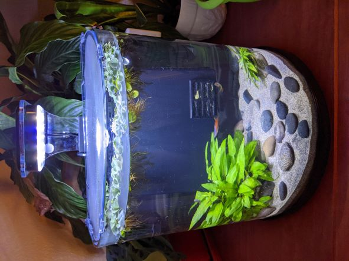

# light-timer
Arduino project to turn fish tank light on/off at sunrise/sunset.

## Background
As a distraction from pandemic related current events, I've decided to dip my toe into aquariums. At the onset of this project, I knew nothing about fish keeping or aquarium maintenance. I'd wandered into my local fish store and said, "I'm thinking about getting a fish." The salesperson happily loaded me up with a tank, supplies, live plants, and animals. I hurried home and quickly threw together an environment for my new friends. I was rushed, learning how to prepare the tank while the fish patiently waited. I don't know if fish have feelings, but they look pretty happy in their new home. Since then, I've been reading up and discovering all the things I've been doing wrong.  

## My Tank
Here's the specs: 
- Aquatop Pisces Bowfront 5G All-in-One Nano Tank. This includes a touch sensitive LED light with On/Moonlight/Off settings.
- I have a couple different plants planted in Oregon Coast sand and stone substrate. 
- Another type of plant is floating on the surface.
- (2) Endlers.
- (2) silvery fish with blue eyes. Maybe rainbowfish?
- (3) Shrimp: Cherry, Crystal, and Yellow.  

## Problem 
One thing I'm learning is how nutrient levels and light exposure affect plant growth. Too much of either can apparently lead to unwanted algae blooms. Yuck. To combat this, I've become more conscious of serving size at feeding times. I've improved. The fish still seem to be eating enough, and I don't have leftovers sitting on the bottom of my tank. Lighting is a different issue. I don't know how much light is the right amount of light. I reason, my plants and animals are all typically found in streams and rivers. Those locations all have a day/night cycle. From day to day, that light cycle is pretty consistent. Sunrise and sunset today were only a few minutes different from the same event yesterday. However, over the course of a year we have wide differences in day length between our longest and shortest days. I wanted to simulate these seasonal changes for my tank by switching between On and Moonlight at my local sunrise/sunset times.  

Let's get this out of the way; I'm unwilling to change my routine such that I'm available to tap the light everyday at sunrise and sunset. This is an obvious problem to solve with automation.  

## Solution
### Materials
- Arduino Pro Micro ATmega32U4 (5v, 16MHz)
- DS3231 Real Time Clock
- 2N2222 NPN Transistor
- Aquatop Pisces 5G Aquarium LED Light (modified)

### Light Prep
I popped the LED case open and inspected the driver circuit. The touch sensor was incredibly sensitive. I wasn't able to intercept it. The light uses a 12V power supply. Moonlight and White light circuits are ground switched. I observed that Moonlight remains on while the White light is on. I soldered (3) wires onto the circuit board and extended them outside the case. (BLK) power supply ground, (YLW) power supply +12V, (RED) White light +7.2V.  

### Circuit Wiring:
- +12v Fish Tank Light (Yellow Wire; +11.91v measured) to Toggle Switch (PWR)
- Toggle Switch (PWR) to Arduino RAW 
- GND Fish Tank Light to Arduino GND (Black Wire)
- Arduino VCC to RTC VCC
- Arduino GND to RTC GND
- Arduino PIN 2 to RTC SDA
- Arduino PIN 3 to RTC SCL
- Arduino GND to Transistor Emitter (PIN3)
- Arduino PIN A9 to 4.7 kOhm Resistor (R1)
- R1 to Transistor Base (PIN2)
- Transistor Collector (PIN1) to White Light PWR (Red Wire; +7.2v measured) 

### Data
I retrieved an .XLS of sunrise/sunset times for the entire year from the [NOAA Global Monitoring Laboratory website](https://gml.noaa.gov/grad/solcalc/calcdetails.html). After entering my local coordinates, i examined the sunrise and sunset data for the year. Coding a daily lookup table consumed too much memory. I decided to use a monthly lookup table. I found the latest sunrise and sunset times for the month and rounded to the nearest 10 minutes.

### Logic
- At Power ON, turn light on/off based on expected state for current time.
- If it's sunset, dim light over 10 minutes until light at 0%.
- If it's sunrise, increase light over 10 minutes util light at 100%.

## Operating Notes
Light will auto-cycle between Moonlight and ON at Sunset/Sunrise with dimming transitions.  
Light Timer only controls LED White Light function. LED Touch Sensor remains operational.  
For auto-cycle operation between Moonlight and ON, leave LED Touch Sensor switched to Moonlight.  
For auto-cycle operation between OFF and ON, leave LED Touch Sensor switched OFF. (Not recommended)
  *This will affect light color. LED is intended to operate with both Moonlight and White light on.  
If LED Touch Sensor is switched to ON, Light Timer will have no effect.  

## Failed attempts
- I went on the big ecommerce site and searched for a fish tank light timer. I found something that plugged inline with my light's power supply. It had selectable hour intervals and a sunrise / sunset function. I  gave it a try. Turns out, my light isn't compatible with the timer's sunrise/sunset function. My light would pass through a strobe phase as it increased brightness from 0% to 100%. Once it reached 100% brightness, it would be in Moonlight mode regardless of the mode it was in last. That wasn't anticipated and wasn't acceptable . Additionally, because it operated inline with the power supply, the light would be powered off at night rather than using the Moonlight mode. This helped clarify my desired behavior. I want my light to switch between On and Moonlight modes. The dimmer ramp at on/Moonlight transitions would be cool too.  
- Multiple attempts at interfacing with the lights built-in capacitive touch sensor. I was able to trigger it with a simple piece of foil and wire. But, I could not trigger it while attached to the Arduino. Pulling the pin HIGH/LOW had no effect.
- I attempted to manipulate capacitance of the trigger wire. I used a short trigger wire/foil attached to a relay that, when switched, would connect to a longer section of wire. Turns out, the trigger wire attached to relay had enough capacitance to trip the light sensor. After that point, switching the relay had no effect. A physically smaller relay could be worth trying. I didn't have one on hand.
- I tried to switch the light by attaching it directly to a pin on the Arduino pulled LOW. That worked once, maybe twice, before I had stability issues. Voltage mismatch cooked my Arduino.
- Soldered up a new Arduino and loaded code. It ran well for a couple minutes before the stability issues. When it dropped my serial connection for the last time, I observed a tiny glowing spark between pins on the ATMega chip. With a wisp of smoke, it was like a tiny campfire. Chalk this up to an assembly defect. Mine or the manufacturer's, we'll never know.
- After soldering up a 3rd Arduino, I tried a code varient that used a sunrise/sunset time lookup table for every day of the year. I quickly ran out of memory on the little Arduino and had to refactor.
- I used a relay to switch the LED on/off. This didn't get me the dimmer ramp on transitions. It would be really noisy trying to handle a PWM signal, even if it could switch fast enough.
